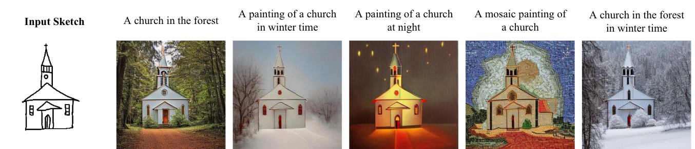

# U-Sketch: Bridging the Gap for Efficient and Realistic Sketch-to-Image Synthesis

This repository contains the implementation of our paper titled *U-Sketch: An Efficient Approach for Sketch to Image Diffusion Models*.



## Abstract
Diffusion models have demonstrated remarkable performance in text-to-image synthesis,
producing realistic and high resolution images that faithfully adhere to the corresponding text-prompts.
Despite their great success, they still fall behind in sketch-to-image synthesis tasks, where in addition to text-
prompts, the spatial layout of the generated images has to closely follow the outlines of certain reference
sketches. Adapter-like networks, such as ControlNet and T2I-Adapters, are computationally intensive to
train and do not consistently yield realistic results; whereas, prior MLP-based latent edge predictors operate
on a per-pixel basis and fail to consider the spatial layout holistically, thus resulting in time inefficiency
due to numerous required denoising iterations. To this end, we introduce U-Sketch, a framework featuring a
U-Net type latent edge predictor, which is capable of efficiently capturing both local and global features, as
well as spatial correlations between pixels. The proposed approach also incorporates a sketch simplification
network that allows users to preprocess and simplify input sketches for enhanced outputs, as well as a noise
initialization strategy that aligns the intrinsic spatial layout of the noise with the desired structure, thereby
facilitating the denoising process. The experimental results, corroborated by user feedback, demonstrate that
our U-Sketch leads to more realistic results that are better aligned with the spatial outlines of the reference
sketches. Additionally, it also drastically reduces the need for extensive computational resources for training
or fine-tuning, as well as the number of required denoising steps, thereby decreasing overall execution time.

## Installation
To run the code, please follow these steps:
1. Create a new directory named *models-checkpoints*
```
mkdir models-checkpoints
```
2. Download Unet Latent Edge Predictor checkpoint
```
pip install gdown 
```
```
cd models-checkpoints
gdown https://drive.google.com/uc?id=1w7eimErXnnRrjY6TY8yXrmno-hvcZ94_
```
3. Download [Sketch Simplification Network](https://mega.nz/folder/2lUn1YbY#JhTkB1vdaBMeTCSs37iTVA/file/OsdxVQaD) checkpoint into the models-checkpoint directory (model_gan.pth)
4. Try U-Sketch demo in the Jupyter notebook `usketch-demo.ipynb`

## Citations
*Sketch Simplification Network*
-  Simo-Serra, E., Iizuka, S., Sasaki, K., & Ishikawa, H. (2016). Learning to simplify: fully convolutional networks for rough sketch cleanup. ACM Transactions on Graphics (TOG), 35(4), 1-11.  [access here](https://doi.org/10.1145/2897824.2925972)
- Simo-Serra, E., Iizuka, S., & Ishikawa, H. (2018). Mastering sketching: adversarial augmentation for structured prediction. ACM Transactions on Graphics (TOG), 37(1), 1-13.
 [access here](http://arxiv.org/abs/1703.08966)
  
*MLP baseline*
- Voynov, A., Aberman, K., & Cohen-Or, D. (2023). Sketch-guided text-to-image diffusion models. In ACM SIGGRAPH 2023 Conference Proceedings (pp. 1-11).
See implementation [here](https://github.com/Mikubill/sketch2img).

*Stable Diffusion*
- Rombach, R., Blattmann, A., Lorenz, D., Esser, P., & Ommer, B. (2022). High-resolution image synthesis with latent diffusion models. In Proceedings of the IEEE/CVF conference on computer vision and pattern recognition (pp. 10684-10695). [access here](https://openaccess.thecvf.com/content/CVPR2022/html/Rombach_High-Resolution_Image_Synthesis_With_Latent_Diffusion_Models_CVPR_2022_paper.html)
